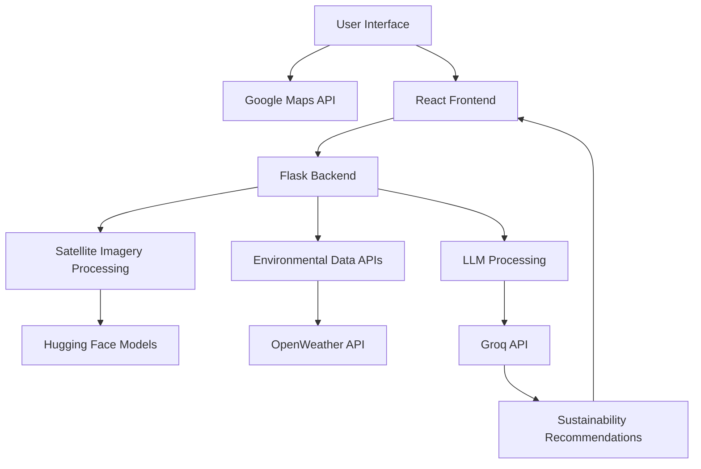

# 🌱 Envirolyst

<div align="center">
  
  
  **AI-Powered Environmental Analysis for Sustainable Decision Making**
  
  [](https://reactjs.org/)
  [](https://flask.palletsprojects.com/)
  [](https://python.org/)
  [](https://tailwindcss.com/)
  [](https://vitejs.dev/)
  
  🏆 **Built for GarudaHacks 6.0**
</div>

---

## 🌍 About Envirolyst

Indonesia's rich natural resources and green landscapes face unprecedented threats from unsustainable business practices. Deforestation, pollution, and ecosystem degradation continue to accelerate as industries expand without considering long-term environmental impact.

**Envirolyst** revolutionizes environmental decision-making by providing AI-powered satellite imagery analysis, delivering actionable sustainability insights for responsible development and conservation efforts.

### 🎯 Mission
To bridge the gap between business growth and environmental stewardship through intelligent, data-driven recommendations.

---

## ✨ Key Features

### 🛰️ **AI-Powered Land Use Classification**
- Advanced deep learning segmentation models
- Detects vegetation, water bodies, built-up zones, and bare land
- Powered by Hugging Face's state-of-the-art models

### 🌫️ **Real-Time Environmental Monitoring**
- Live air quality index (AQI) tracking
- Pollutant level assessment
- Integrated with OpenWeather API

### 🌦️ **Weather Data Integration**
- Current weather conditions
- Climate pattern analysis
- Enhanced recommendation accuracy

### 💡 **LLM-Generated Insights**
- Context-aware sustainability recommendations
- Powered by Groq API
- Tailored to local environmental conditions

### 🗺️ **Interactive Mapping Interface**
- Google Maps integration
- Point-and-click area selection
- Real-time analysis triggering
- Detailed sustainability reports

---

## 🏗️ Architecture



---

## 🚀 Quick Start

### Prerequisites
- Node.js 18+ and npm
- Python 3.8+
- API Keys for:
  - Google Maps API
  - OpenWeather API
  - Groq API

### 🔧 Installation

1. **Clone the repository**
   ```bash
   git clone https://github.com/MuhammadFarrasThohari/GarudaHacks6.git
   cd GarudaHacks6
   ```

2. **Frontend Setup**
   ```bash
   npm install
   npm run dev
   ```

3. **Backend Setup**
   ```bash
   cd backend
   pip install -r requirements.txt
   python app.py
   ```

4. **Environment Configuration**
   ```bash
   # Create .env file with your API keys
   GOOGLE_MAPS_API_KEY=your_key_here
   OPENWEATHER_API_KEY=your_key_here
   GROQ_API_KEY=your_key_here
   ```

### 🌟 Usage

1. **Select Area**: Use the interactive map to select your area of interest
2. **Upload Satellite Image**: Submit satellite imagery for analysis
3. **Get Analysis**: Receive AI-powered land use classification
4. **View Recommendations**: Get personalized sustainability insights
5. **Explore Initiatives**: Discover nearby community environmental projects

---

## 🛠️ Tech Stack

### Frontend
- **React 19.1.0** - Modern UI framework
- **Vite** - Lightning-fast build tool
- **Tailwind CSS 4.1.11** - Utility-first styling
- **Google Maps API** - Interactive mapping
- **Lucide React** - Beautiful icons
- **Recharts** - Data visualization

### Backend
- **Flask 3.1.1** - Lightweight web framework
- **Hugging Face** - AI model integration
- **OpenWeather API** - Environmental data
- **Groq API** - LLM processing
- **Python 3.8+** - Core backend language

### AI & Machine Learning
- **Deep Learning Segmentation** - Land use classification
- **Large Language Models** - Intelligent recommendations
- **Computer Vision** - Satellite image processing

---

## 💻 Mockups

<div align="center">
  
  
  
  
</div>

---

## 🔬 Technical Deep Dive

### Image Processing Pipeline
1. **Satellite Image Ingestion** - Multi-format support
2. **Preprocessing** - Normalization and enhancement
3. **AI Segmentation** - Hugging Face model processing
4. **Classification** - Land use type identification
5. **Results Integration** - Environmental data fusion

### Environmental Data Processing
- **Air Quality Monitoring** - Real-time AQI tracking
- **Weather Integration** - Current conditions analysis
- **Historical Data** - Trend analysis capabilities
- **Predictive Insights** - Future impact projections

---

## 🎯 Future Roadmap

### 🔧 **Technical Improvements**
- [ ] Enhanced model accuracy through fine-tuning
- [ ] Multi-temporal analysis capabilities
- [ ] Mobile application development
- [ ] Offline analysis support

### 📊 **Data Enhancement**
- [ ] Advanced visualization dashboards
- [ ] Historical trend analysis
- [ ] Comparative regional studies
- [ ] Predictive modeling integration

### 🌐 **Platform Expansion**
- [ ] Multi-language support
- [ ] API for third-party integration
- [ ] Enterprise dashboard
- [ ] Community collaboration features

---

## 🤝 Contributing

We welcome contributions from the community! Please see our [contributing guidelines](CONTRIBUTING.md) for more information.

1. Fork the repository
2. Create your feature branch (`git checkout -b feature/AmazingFeature`)
3. Commit your changes (`git commit -m 'Add some AmazingFeature'`)
4. Push to the branch (`git push origin feature/AmazingFeature`)
5. Open a Pull Request

---

## 📄 License

This project is licensed under the MIT License - see the [LICENSE](LICENSE) file for details.

---

## 🏆 Acknowledgments

- **GarudaHacks 6.0** - For providing the platform to innovate
- **Hugging Face** - For accessible AI model infrastructure
- **OpenWeather** - For comprehensive environmental data
- **Google Maps** - For robust mapping capabilities
- **Our Amazing Team** - For making this vision a reality

---

**Team Envirolyst**
- 🌐 [Project Demo](https://youtu.be/Ds4v4NfNRKc)

---

<div align="center">
  <p><strong>🌱 Insightful Views Purposeful Steps 🌱</strong></p>
  
  **Made with ❤️ for the environment and powered by AI**
  
  ⭐ **Star this repository if you found it helpful!** ⭐
</div>
